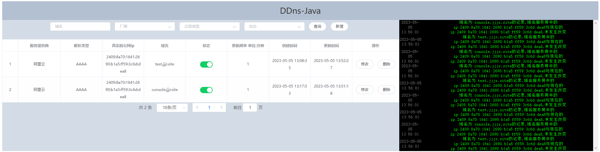

# DDNS4J 使用指南

阅读前需知悉:

该<<使用指南>>由gpt生成,如果有错误欢迎大家指正,目前该项目由于只有我一个人闲暇时间开发,目前只支持阿里云,后续版本会加上腾讯云及cloudflare.

DDNS4J 是一个基于 SpringBoot 和 Vue2 开发的开源 DDNS 服务，支持 IPv4 和 IPv6，能够帮助用户动态更新域名解析记录，从而方便地将个人服务器或家庭网络对外提供服务。在本篇文章中，我们将介绍如何使用 DDNS4J 来轻松管理你的域名，并探讨 DDNS 在 IPv6 时代的重要性。

## DDNS 的发展
DDNS 即动态 DNS，是一种可以自动更新域名解析记录的 DNS 服务。传统 DNS 服务需要手动维护域名解析记录，这对于动态 IP 地址来说非常不方便。因此，DDNS 应运而生，能够实现自动更新域名解析记录，让用户更加方便地访问网络资源。DDNS（Dynamic Domain Name System，动态域名系统）是一种通过将域名与动态 IP 地址进行绑定，使得能够通过一个不变的域名来访问处于动态 IP 环境下的主机的技术。在 IPv4 时代，DDNS 技术已经成为了广泛应用的网络技术，它为个人用户提供了一种简单易用的方式来管理自己的网络设备。而在 IPv6 时代，由于 IPv6 地址的数量庞大，DDNS 将变得更加重要，因为动态 IPv6 地址变化的频率更高，使用 DDNS 可以方便地将域名与新的 IP 地址进行绑定。

随着 IPv6 的逐渐普及，越来越多的用户拥有了多个 IPv6 地址。而 DDNS4J 就是一款支持 IPv6 的 DDNS 客户端，为用户提供更加便捷的 DDNS 服务。

## DDNS4J 的作用及好处
使用 DDNS4J，用户可以方便地将个人服务器或家庭网络对外提供服务。比如，用户可以使用 DDNS4J 将自己家里的摄像头、文件共享服务等对外提供服务，而不必担心 IP 地址变化导致服务无法访问。DDNS 技术使得拥有动态 IP 地址的用户可以轻松地维护自己的网络设备。它可以方便地让你的路由器和网络摄像头等设备保持与互联网的连接。同时，使用 DDNS 还可以帮助你避免一些网络攻击，例如 DNS 劫持和 DDoS 攻击。此外，如果你拥有多个域名，使用 DDNS 可以帮助你将多个域名映射到同一个 IP 地址上，方便管理和维护。

此外，DDNS4J 还支持多种 DDNS 服务商，用户可以根据自己的需要选择不同的服务商。同时，DDNS4J 还提供了可视化的界面，用户可以方便地管理自己的域名解析记录。

## 技术栈
DDNS4J 使用了以下技术栈：

### 后端：SpringBoot、MyBatis、Thymeleaf
### 前端：Vue2、ElementUI、Axios

## 部署
1. 环境要求：Java 8+、Maven 3.5+、MySQL 5.7+。
2. 克隆项目到本地：
```
git clone https://gitee.com/Xsssd/ddns4j.git
```
3. 在doc文件夹中拿到ddns4j的mysql脚本,并修改 application.yml 配置文件中的数据库连接信息;也可以在发布版中直接下载使用的jar包,前提是必须提前安装了jdk
4. 构建并运行项目：
```
mvn clean package
java -jar ddns-v1.0-RELEASE.jar
```
5. 启动成功后，在浏览器中输入 http://localhost:10000/index.html 即可访问 DDNS4J 的可视化界面。

## 推荐阅读
如果想要深入了解 DDNS 和 DDNS4J，可以访问我的博客 https://blog.sssd.top,博客站点就是使用ddn4j搭建而成,访问较慢请大家海涵

了解更多有关网络和开发的知识。
