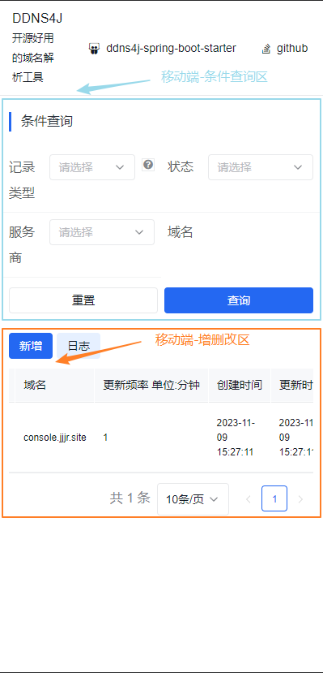
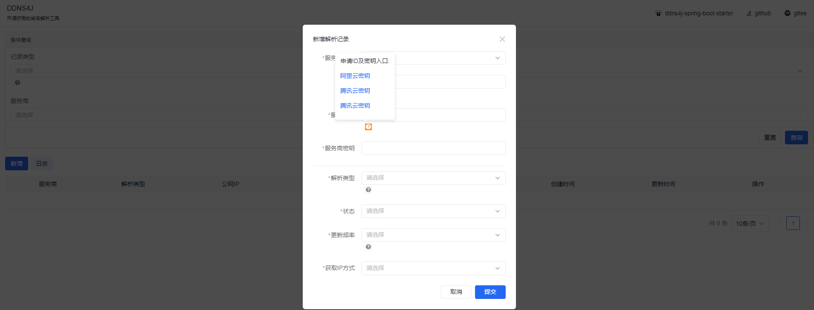

**旨在帮助用户动态更新域名解析记录**

**这个工具适用于需要搭建互联网服务但没有固定公网IP的人，可以替代部分花生壳等动态域名服务。**

<h1 align="center" style="margin: 30px 0 30px; font-weight: bold;">DDNS4J v1.6.2</h1>
<h4 align="center" style="margin: 30px 0 30px; font-weight: bold;">DDNS4J -- 让动态域名解析变的更简单</h4>

<p align="center">
<a href='https://gitee.com/Xsssd/ddns4j/stargazers'></img></a>
<a href='https://gitee.com/Xsssd/ddns4j/members'></img></a>
<a href='https://img.shields.io/badge/license-apache-blue'></img></a>
</p>


# DDNS4J 使用指南
- 功能区介绍



## 新手使用步骤
1. 购买域名
 - [阿里云域名](https://wanwang.aliyun.com/domain)
 - [腾讯云域名](https://dnspod.cloud.tencent.com/)
 - [cloudflare](https://www.cloudflare.com/zh-cn/products/registrar/)
2. 申请密钥
  - [阿里云密钥入口](https://ram.console.aliyun.com/manage/ak)
  - [腾讯云密钥入口](https://console.dnspod.cn/account/token/apikey)
  - [cloudflare密钥入口](https://dash.cloudflare.com/profile/api-tokens)
3. 使用ddns4j
   - jar包方式
      - 需要安装jdk或者jre环境(后续版本会出整合包,不用安装jdk环境)
      - [下载最新版jar包](https://gitee.com/Xsssd/ddns4j/releases)
      - 启动jar包
     ```
     java -jar ddns-v1.6.2-RELEASE.jar
     ```
   - docker方式
     ```
     docker run -itd --name=ddns4j --restart=always --network=host  topsssd/ddns4j:v1.6.2
     ```
   - 浏览器输入 http://ip:10000 进入使用
4. 填入密钥及域名更新频率等信息,ddns4j会使用您所选择的多种方式自动识别你的ipv4或者ipv6公网地址,进行记录解析,从而达到接入互联网的目的
   
5. 恭喜您!已成功接入互联网

****

DDNS4j基本介绍:

目前已支持阿里云,腾讯云,Cloudflare,并默认开启Cloudflare代理.

DDNS4J 是一个基于 SpringBoot 和 Vue2 开发的完全免费开源 DDNS 服务，支持 IPv4 和 IPv6，能够帮助用户动态更新域名解析记录，从而方便地将个人服务器或家庭网络对外提供服务。

## 项目演示地址

https://ddns4j.sssd.top

演示地址中的数据均为演示数据,非真实数据,如要使用,请在发布版下载jar包或使用构建工具自己打包部署,部署步骤可参照下面部署章节

## 项目目录结构
```
├─doc mysql脚本,项目效果展示相关
└─src 源码总目录
    └─main  核心源码总目录
        ├─java  
        │  └─top
        │      └─sssd
        │          └─ddns
        │              ├─common  通用项目代码
        │              │  ├─constant 项目中使用的常量
        │              │  ├─enums    项目中使用的枚举
        │              │  ├─utils    项目使用的工具类
        │              │  └─valid    项目使用的校验相关工具类
        │              ├─config      项目配置相关类
        │              ├─controller   处理前端路由的控制器处理器
        │              ├─factory      项目中使用的工厂类
        │              ├─handler      项目中使用的处理器,全局异常处理器,日志处理处理器,元数据处理器
        │              ├─mapper       持久层数据访问接口
        │              ├─model        项目中使用的实体类及业务相关类
        │              │  ├─entity     实体类
        │              │  ├─request    接收到请求的类
        │              │  └─response   需要返回响应的类
        │              ├─service       项目中使用到的服务类接口
        │              │  └─impl       服务类接口实现
        │              ├─task          定时任务类
        │              └─utils         封装好的ddns相关厂商的工具类 
        └─resources
            ├─mapper            持久层接口与实体类的映射文件
            └─static
                ├─css           前端相关css文件
                │  └─fonts      前端相关字体
                └─js            前端相关js
                └─index.html    前端操作页面
```

## DDNS 的发展
DDNS 即动态 DNS，是一种可以自动更新域名解析记录的 DNS 服务。传统 DNS 服务需要手动维护域名解析记录，这对于动态 IP 地址来说非常不方便。因此，DDNS 应运而生，能够实现自动更新域名解析记录，让用户更加方便地访问网络资源。DDNS（Dynamic Domain Name System，动态域名系统）是一种通过将域名与动态 IP 地址进行绑定，使得能够通过一个不变的域名来访问处于动态 IP 环境下的主机的技术。在 IPv4 时代，DDNS 技术已经成为了广泛应用的网络技术，它为个人用户提供了一种简单易用的方式来管理自己的网络设备。而在 IPv6 时代，由于 IPv6 地址的数量庞大，DDNS 将变得更加重要，因为动态 IPv6 地址变化的频率更高，使用 DDNS 可以方便地将域名与新的 IP 地址进行绑定。

随着 IPv6 的逐渐普及，越来越多的用户拥有了多个 IPv6 地址。而 DDNS4J 就是一款支持 IPv6 的 DDNS 客户端，为用户提供更加便捷的 DDNS 服务。

## DDNS4J 的作用及好处
使用 DDNS4J，用户可以方便地将个人服务器或家庭网络对外提供服务。比如，用户可以使用 DDNS4J 将自己家里的摄像头、文件共享服务等对外提供服务，而不必担心 IP 地址变化导致服务无法访问。DDNS 技术使得拥有动态 IP 地址的用户可以轻松地维护自己的网络设备。它可以方便地让你的路由器和网络摄像头等设备保持与互联网的连接。同时，使用 DDNS 还可以帮助你避免一些网络攻击，例如 DNS 劫持和 DDoS 攻击。此外，如果你拥有多个域名，使用 DDNS 可以帮助你将多个域名映射到同一个 IP 地址上，方便管理和维护。

此外，DDNS4J 还支持多种 DDNS 服务商，用户可以根据自己的需要选择不同的服务商。同时，DDNS4J 还提供了可视化的界面，用户可以方便地管理自己的域名解析记录。

## 技术栈
DDNS4J 使用了以下技术栈：

### 后端：SpringBoot、MyBatisPlus、Quartz
### 前端：amis
### 数据库 支持mysql、h2

## 交流群
群二维码.png "QQ群二维码")

## 推荐阅读
如果想要深入了解 DDNS 和 DDNS4J，可以访问我的博客 https://blog.sssd.top

该博客站点就是使用ddn4j搭建而成,响应较慢请大家海涵!了解更多有关网络和开发的知识。